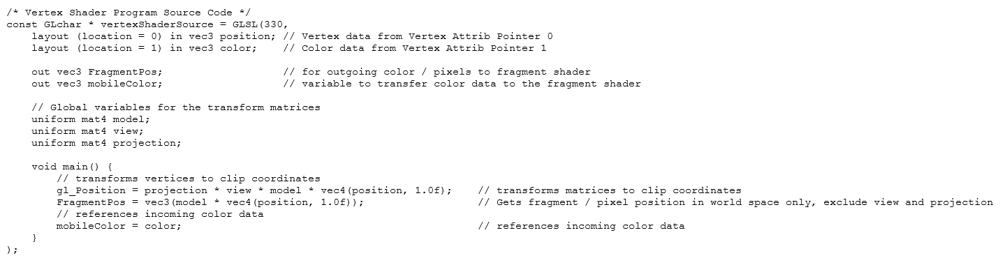
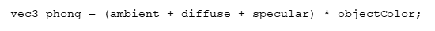

# CS-499 ePortfolio

## Introduction - Software Engineering and Design Artifact

The artifact that I chose is my Final Project from CS-330 Comp Graphic and Visualization. I took that class in July 2020 and it is still fresh in my mind. This project demonstrates my ability to design and code in C++ and modern OpenGL to render an object in 3D. I chose a 4-leg table as the object to use when applying a texture to the object and lighting around the object. The Final Project showed my ability to generate accurate representations of a 3D object using API libraries and computer graphics, showed an application that responded to input devices (keyboard, mouse movement, mouse buttons) that allowed for successful navigation around the 3D object and through 3D space, and showed best practices in formatting, commenting and creating functional logic that produced a reliable fully functional program. I plan to enhance the project by adding additional lighting scenes around the table object.

## Why I Included This Artifact

I chose the C++ program artifact for the following reasons:
- It showcases my ability to program in C++.
- It displays my skill at developing and displaying complex 2D and 3D graphical objects on various coordinate planes, using a variety of mathematical methods.

Tiobe (2020) states that the C++ programming is a language used by 4.58% of software engineers and has been ranked in the top 4 languages since 1990. Given its popularity, I wanted to include a project written in a language I am familiar with. Tiobe (2020) lists programming languages and their rankings each month. As part of my self-analysis, I also wanted to show an example of a language I had used many times on projects.

## Using this Artifact

The entire artifact showcases my expertise in programming in C++. My experience in using multiple coordinate systems is shown in the "URenderGraphics(void)" function when transforming matrixes from model coordinates to world coordinates, then from world coordinates to the camera coordinates (view matrix transformations), and finally through transformations to the homogeneous coordinates where everything is viewed through a viewport.

In my design of the original artifact, I researched the Phong lighting model. Along with my textbook, two other websites, Basic Lighting (n.d.) and Advanced Lighting (n.d.) helped in my understanding of the model and the various lighting sources involved. My use of the Phong model and how to combine the aspect, diffuse and specular lighting effects is shown in the "fragmentShaderSource" code, which is actually a macro that is compiled and processed by the graphical processing unit (GPU). The GPU is located in the video graphics chip on the computer.

Early on in the development of this program in my CS-330 class, I discovered that my code compiled and linked correctly, but did not produce the correct visual output. I knew from my analysis of the code that the GLSL macros were sent to the graphics processing unit for execution. Upon Googling the GLSL macros in the code, I discovered that there the macros were only compiled at run-time by the GPU. I found additional C++ code that detected the run-time compilation status and displayed errors in the macro compilation. Upon adding the macro compilation code, I found that I had an error in one of the two GLSL macros and after fixing the error, my program output was correct. I used the additional code in every assignment after that in the class and it saved me many hours of debugging the code.

## How this Artifact Was Improved

The artifact was improved by completing the lighting functionality for two lights located around my selected object (the 4-legged table). The lights were the key light (most intense lighting effect) and the fill light (a less intense light), located at different points around the object. To make the lights distinguishable from each other, I made the key light green and the fill light red. I placed the key light in the foreground to the left of the object. I placed the fill light on the far side of the object on the right side. The three components of the lighting (ambient, diffuse, and specular) were added using the two lights and the different light intensities and colors. Finally, the Phong lighting model was created using the three components above with the object color using:

## What Did I Learn By Enhancing The artifact

I learned much more about basic lighting, which is ambient, diffuse, and specular, and the Phong lighting model. I spent time studying the theory of lighting and lighting models on several websites, along with working through examples of various techniques. Writing code for manipulating my object in various view spaces with lighting works the same as writing code to solve any other problem; there are multiple ways to implement the same effect. I experimented with various ways to create the Phong lighting, such as keeping two ambient lighting results, two diffuse results, and two specular results, then combining all six results with the object color at the "vec3 Phong = " statement. After some testing of various approaches, I decided to use the 'straightforward' approach, to have only one ambient, diffuse and specular result, then adding the lighting together and multiplying with the matrix object color at the "vec3 Phong = " statement.

**References**

Advanced Lighting. LearnOpenGL.

[Link] (https://learnopengl.com/Advanced-Lighting/Advanced-Lighting)

Basic Lighting. LearnOpenGL.

[Link] (https://learnopengl.com/Lighting/Basic-Lighting)

TIOBE Index for September 2020. (2020, September).

[Link] (https://www.tiobe.com/tiobe-index/)

**Link to Repository**

[Enhancement One Repository](https://github.com/w-coleman-moore/EnhancementOne)

**Porfolio Links** 
* [Professional Self-Assessment](index.md) 
* [Refinement Plan & Code Review](CodeReview.html) 
* [Enhancement One - Software Engineering & Design](EnhancementOne.md) 
* [Enhancement Two - Data Structures & Algorithms](EnhancementTwo.md) 
* [Enhancement Three - Databases](EnhancementThree.md)
