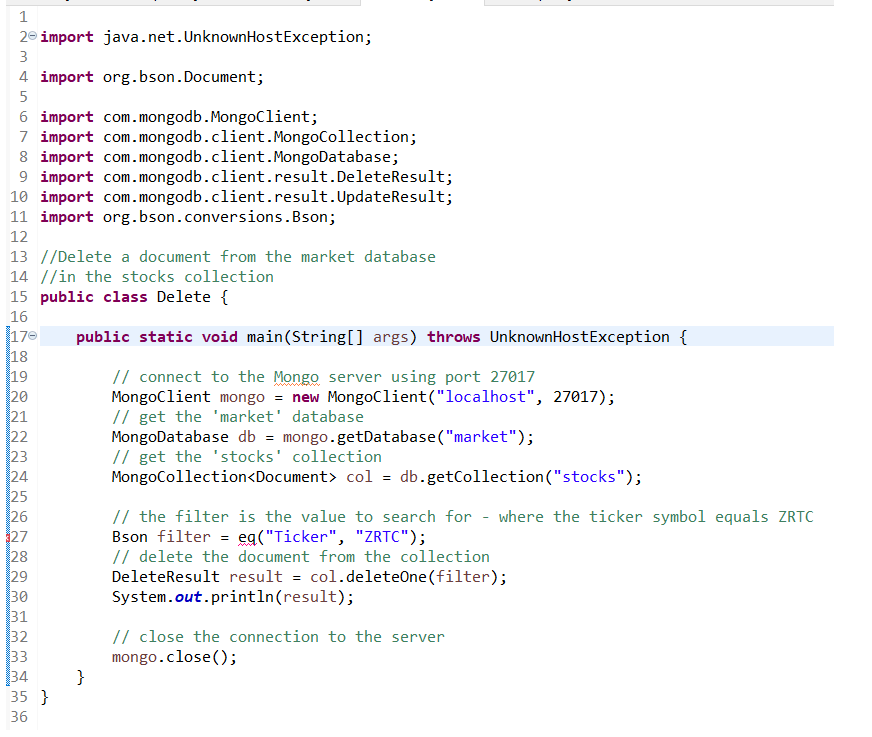

# CS-499 ePortfolio

## Introduction - Databases Artifact

This artifact was part of my Final Project from CS-340 Client Server Development. I took that class in January 2020, and I used MongoDB and code written in Python to manipulate data in databases. This Final Project used a high-level programming language (Python) and used advanced programming techniques that were suitable for use within a full-stack development environment. For my enhancement of this project, I switched to Java to create the same functional results and use the same create, read, update, and delete operations on the stock market database. The complex operations performed in the CS-340 final will also be created in Java, with the five top stocks reported by an industry selection I chose.

Since this artifact is intended to showcase my ability when working with databases, I chose a project that works with MongoDB databases. MongoDB Driver (n.d.) provides an excellent tutorial on using Java CRUD functions of Create, Read, Update and Delete with MongoDB databases. I also included a function that shows a complex operation, one where the top five stocks were searched, retrieved and displayed.

## Why I Included This Artifact

In this project, I demonstrated my mastery of the following outcomes – analyzing code functionality in one language and recoding in another language.

I chose the artifact for the following reasons:
-	It showcases my skill in programming in Java.
-	It displays my skill in programming in Python (the initial artifact before enhancement).
-	It shows that I can analyze the functionality and outcome in one language and create the same functionality and outcome in another language (Java in this example).
-	It shows that I understand the basic database operations
-	opening the database
- basic CRUD operations (Create, Read, Update, Delete)
- -	creating a document
- -	reading a document
- - updating a document
- -	deleting a document
-	performing complex operations on a document
-	closing the database

## Using this Artifact

The entire original artifact source file shows my ability to program in Python. The enhanced artifact shows my ability to program in Java.
Since this artifact is intended to showcase my ability when working with databases, I chose a project that works with MongoDB databases. MongoDB Driver (n.d.) provides an excellent tutorial on using Java CRUD functions of Create, Read, Update and Delete with MongoDB databases. I also included a function that shows a complex operation, one where the top five stocks were searched, retrieved and displayed.

## How this Artifact Was Improved

The artifact was improved by rewriting the project code in Java. This would be important in a situation where Java was a customer or product requirement.

## Challenges

I faced several challenges in converting the Python code to Java and then in implementing and testing the Java code. Beugnet, M (2020) provided a great tutorial for implementing CRUD operations in Java, including general examples for the create, read, update and delete functions. From this, I developed a template for the general code structure and added the specific functions to each module. Designing MongoDB queries for the complex function code required the use of 'Bson Filters' which provided filter statements that could be and'ed, or'ed or equaled to provide the desired results (How Can I Build an $or Query, n.d.). The filter was then used in the find() function to collect a set of documents that matched the filters. The array list of documents that were found were then iterated through and the results printed on the console display.

## What Did I Learn By Enhancing The artifact

I learned how to use the familiar Python functions for MongoDB in Java code, and the specific adaptations that were made for Java. Many similarities exist in the logical flow of the code compared to Python, but there were a number of small differences in syntax. It had been a while since I programmed in Java using Eclipse with Maven, and I had to refamiliarize myself with the use of Maven in Java projects.
The greatest benefit I received in performing this enhancement was learning how to work with MongoDB databases in Java code.

## Original Python Artifacts

## Enhanced Java Artifacts

## References

Beugnet, M. (2020, February 29). Learn how to use MongoDB with Java in this CRUD operations tutorial. MongoDB Developer Hub. https://developer.mongodb.com/quickstart/java-setup-crud-operations
[Link] (https://developer.mongodb.com/quickstart/java-setup-crud-operations)

How can I build an $or query for MongoDB using the Java driver? Stack Overflow. https://stackoverflow.com/questions/10620771/how-can-i-build-an-or-query-for-mongodb-using-the-java-driver
[Link] (https://stackoverflow.com/questions/10620771/how-can-i-build-an-or-query-for-mongodb-using-the-java-driver)

MongoDB Driver Quick Tour. Quick Tour. https://mongodb.github.io/mongo-java-driver/3.0/driver/getting-started/quick-tour/
[Link] (https://mongodb.github.io/mongo-java-driver/3.0/driver/getting-started/quick-tour/)

**Link to Repository**

[Enhancement Three Repository](https://github.com/w-coleman-moore/EnhancementThree)

### Portfolio Links

**Porfolio Links** 
* [Professional Self-Assessment](index.md) 
* [Refinement Plan & Code Review](CodeReview.md) 
* [Enhancement One - Software Engineering & Design](EnhancementOne.md) 
* [Enhancement Two - Data Structures & Algorithms](EnhancementTwo.md) 
* [Enhancement Three - Databases](EnhancementThree.md)
