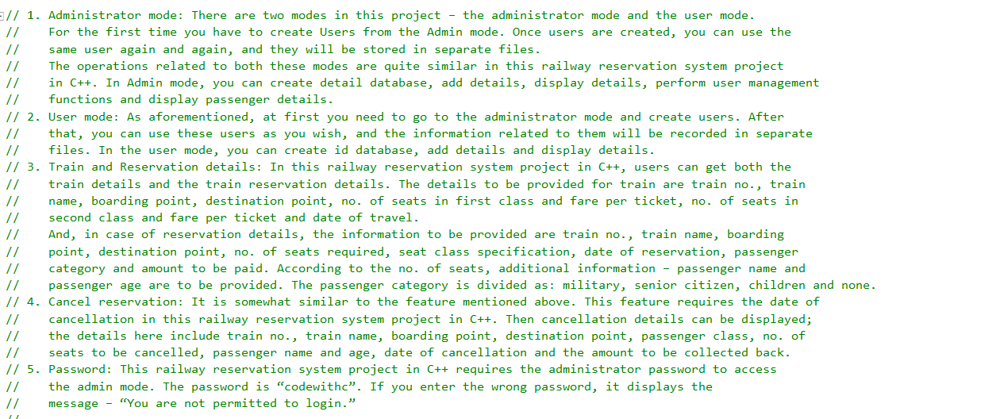
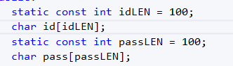
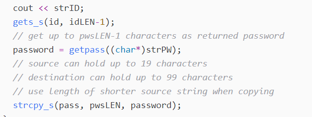
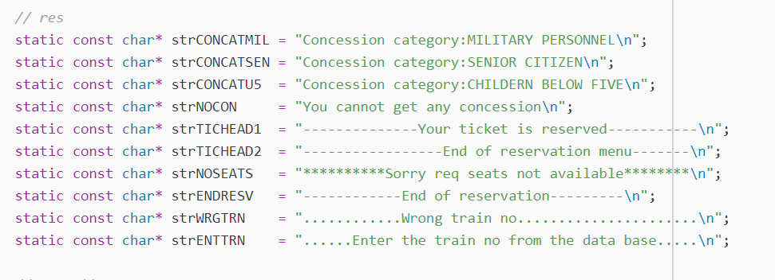

# CS-499 ePortfolio

## Introduction - Data Structures and Algorithms Artifact

This artifact was part of my Final Project from CS-405 Secure Coding, which I took in September 2019. In that class, I was given a small C++ project with five source files and I was to find vulnerabilities and security flaws in the project code. As part of the Final Project in that class, I created a document that listed the vulnerabilities and security flaws I found and the solutions I implemented.

My enhancements to the project were to use visual assessment and static analysis tools on a more complicated set of C++ code files. The project I selected came from a website that provides source code files for various types of projects (CodeWithC, 2014).  I chose the Railway Reservation System, which is a project consisting of one C++ file. I completed the enhancements using this project and created a document that lists the code and the analysis results.

The original project was written in C++ on the Eclipse Integrated Development Environment (IDE). For the enhancement project, I chose the Visual Studio IDE, which includes a built-in static analysis tool.

In researching the static analysis tools and methods to use in finding vulnerabilities and security flaws, I found Reed (2019) to be a great source of information on the static analysis tool included with Visual Studio. Svoboda (2018) was another excellent resource for learning about secure coding standards and methods when writing C and C++ code.

## Why I Included This Artifact

In this project, I demonstrated my mastery of the following outcomes – analyzing source code using manual and automated testing methods for the identification of potential vulnerabilities and code weaknesses, evaluating the vulnerabilities I identified using best practices and industry standards, and describing the implications on non-secure code, modifying the code by correcting weaknesses and reducing vulnerabilities, and recommending testing processes and necessary protocols for producing secure code.

I chose the artifact for the following reasons:
- It showcases my ability to develop secure code.
- It displays my skill in analyzing existing code for vulnerabilities and security weaknesses and in fixing that code to eliminate risks.

## Using this Artifact

The entire artifact C++ source file shows the inclusion of block and line comments that make the code more understandable. The addition of the comments will show that I can read, understand and document code. I created a separate document with details on the vulnerabilities and security flaws I found in the code. That summary list shows that I can analyze one or more code files and determine where weaknesses, security flaws and bad coding practices exist, and how I fixed them to produce robust code.

## How this Artifact Was Improved

The artifact was improved by removing code vulnerabilities and security weaknesses and by adding block and line comments. When received, the code had no comments of any form. I added numerous block and line comments to the code.

I changed all the hard-coded string buffer lengths into const int variables and the set the buffers to the assigned length. Nothing is hard coded anymore.

Library functions such as gets and strcpy were changed to a secure version of the function gets_s and strcpy_s that includes the length of the data to be processed.

Removed all inline string literals from the code and placed them together for easy reference. Each string is identified by a static const char*  value.

Comments were added to all of the code, below is an example of comments added to a loop.

## What Did I Learn By Enhancing The artifact

When inspecting the artifact visually, I used the SEI CERT C Coding Standard (Svoboda, 2018) as my guide when looking for vulnerabilities. The Software Engineering Institute (SEI) "was established in 1984 as a federally funded research and development center" (Software Engineering Institute, n.d.). The coding standards developed at SEI included support for many programming languages. I used the standards that were developed for C and C++ when reviewing the Railway Reservation System. I learned about coding standards and the standards for developing secure code that mitigates weaknesses and security flaws.
I also reviewed and used several static analysis tools in the process of improving the code I selected. Two of the tools easily integrated with Visual Studio, a third tool ran from the Windows command line with the path and name of the file provided.

The only challenge I faced was the amount of time it took to modify the original code with all of the changes that needed to be made. After doing a visual inspection of the code, and running two static analysis tools on the code, I needed to make lots of changes to functions and character strings. Then I began slowly walking through the code and adding comments to the code. Understanding and then documenting the code took more time than the inspections I had performed.

## References

CodeWithC. (2014, June 28). Railway Reservation System C++ Project. Code with C. https://www.codewithc.com/railway-reservation-system-project-in-c/

[Link] (https://www.codewithc.com/railway-reservation-system-project-in-c/)

Reed, K., 15, A. P. J., Pardoe, A., 16, E. M. J., & Eric Mittelette. (2019, February 18). C++ Static Analysis Improvements for Visual Studio 2017 15.6 Preview 2. C++ Team Blog. https://devblogs.microsoft.com/cppblog/c-static-analysis-improvements-for-visual-studio-2017-15-6-preview-2/

[Link] (https://devblogs.microsoft.com/cppblog/c-static-analysis-improvements-for-visual-studio-2017-15-6-preview-2/)

Svoboda, D. (2018, December 5). SEI CERT C Coding Standard. https://wiki.sei.cmu.edu/confluence/display/c/SEI+CERT+C+Coding+Standard

[Link] (https://wiki.sei.cmu.edu/confluence/display/c/SEI+CERT+C+Coding+Standard)

**Link to Repository**

[Enhancement Two Repository](https://github.com/w-coleman-moore/EnhancementTwo)

### Portfolio Links

**Porfolio Links** 
* [Professional Self-Assessment](index.md) 
* [Refinement Plan & Code Review](CodeReview.md) 
* [Enhancement One - Software Engineering & Design](EnhancementOne.md) 
* [Enhancement Two - Data Structures & Algorithms](EnhancementTwo.md) 
* [Enhancement Three - Databases](EnhancementThree.md)
